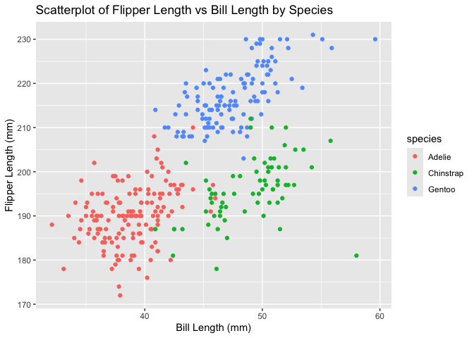

p8105_hw1_qc2337
================
2024-09-21

# hw1 Problem 1

``` r
# First loaded the palmerpenguins package and load pemnguins dataset
library(palmerpenguins)
data("penguins", package = "palmerpenguins")

# Second description of the penguins dataset using inline R code
# Show variable names
names(penguins)
```

    ## [1] "species"           "island"            "bill_length_mm"   
    ## [4] "bill_depth_mm"     "flipper_length_mm" "body_mass_g"      
    ## [7] "sex"               "year"

``` r
# Show structure of the dataset
str(penguins)
```

    ## tibble [344 × 8] (S3: tbl_df/tbl/data.frame)
    ##  $ species          : Factor w/ 3 levels "Adelie","Chinstrap",..: 1 1 1 1 1 1 1 1 1 1 ...
    ##  $ island           : Factor w/ 3 levels "Biscoe","Dream",..: 3 3 3 3 3 3 3 3 3 3 ...
    ##  $ bill_length_mm   : num [1:344] 39.1 39.5 40.3 NA 36.7 39.3 38.9 39.2 34.1 42 ...
    ##  $ bill_depth_mm    : num [1:344] 18.7 17.4 18 NA 19.3 20.6 17.8 19.6 18.1 20.2 ...
    ##  $ flipper_length_mm: int [1:344] 181 186 195 NA 193 190 181 195 193 190 ...
    ##  $ body_mass_g      : int [1:344] 3750 3800 3250 NA 3450 3650 3625 4675 3475 4250 ...
    ##  $ sex              : Factor w/ 2 levels "female","male": 2 1 1 NA 1 2 1 2 NA NA ...
    ##  $ year             : int [1:344] 2007 2007 2007 2007 2007 2007 2007 2007 2007 2007 ...

``` r
# Size of the dataset
nrow(penguins)
```

    ## [1] 344

``` r
ncol(penguins)
```

    ## [1] 8

``` r
# Mean flipper length calculation
mean_flipper_length <- mean(penguins$flipper_length_mm, na.rm = TRUE)
mean_flipper_length
```

    ## [1] 200.9152

``` r
# Make a scatterplot
library(ggplot2)
ggplot(data = penguins, aes(x = bill_length_mm, y = flipper_length_mm, color = species)) +
    geom_point() + 
    labs(title = "Scatterplot of Flipper Length vs Bill Length by Species",
         x = "Bill Length (mm)",
         y = "Flipper Length (mm)")
```

    ## Warning: Removed 2 rows containing missing values or values outside the scale range
    ## (`geom_point()`).

<!-- -->

``` r
# Save the scatterplot
ggsave("penguins_scatterplot.png")
```

    ## Saving 7 x 5 in image

    ## Warning: Removed 2 rows containing missing values or values outside the scale range
    ## (`geom_point()`).
